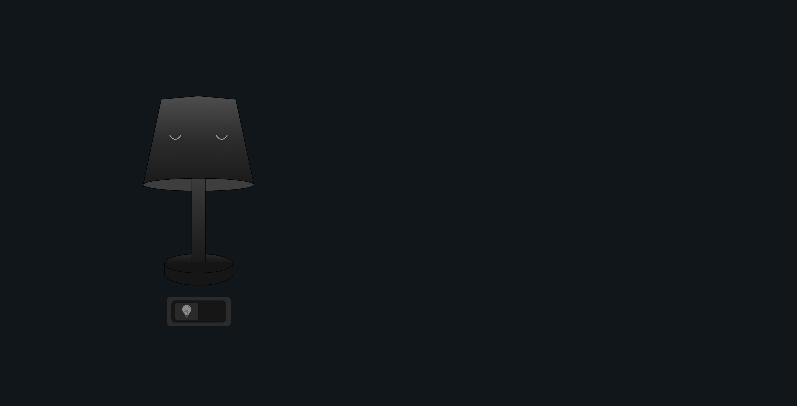
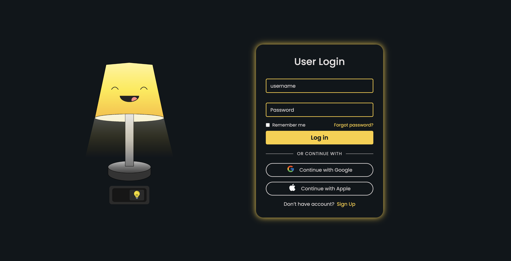

# 💡 Interactive Lamp Login System

An interactive and modern authentication UI where a lamp animation controls the visibility of the login card.  
When the lamp is turned **ON**, the login/signup forms reveal with smooth transitions.  
The project includes **Login, Signup, and Forgot Password** sections — all with floating labels and clean UI.

---

## 🚀 Features

- 💡 **Lamp Toggle Animation** to reveal/hide login content
- 🔐 **Login Form** with custom floating input fields
- 📝 **Signup Form** with fields for personal details
- ✉️ **Forgot Password** screen with reset email flow
- 🎨 **Responsive UI** with adaptive layouts
- ⚡ **Smooth transitions & minimalistic design**
- ❌ **No browser auto-suggest** for clean input fields
- ♻️ **Input reset functionality included**

---

## 🛠️ Technologies Used

- **HTML**
- **CSS**
- **JavaScript**
- **Font Awesome Icons**

---

## 📸 Preview

<p align="center">
  
  
</p>
<p align="center">
  
  
</p>

---

### ⭐ **Form Switch**

- Login → Signup
- Signup → Login
- Forgot Password → Login

All form transitions are handled using JS.

---

### ⭐ **Input Reset**

All input fields (login, signup, forgot password) are reset using:

```javascript
resetAllInputs();
```

---

## 📥 How to Clone

1. Clone this repository

```bash
git clone https://github.com/Rohan-Korake/Glowing-lamp-login.git
```

---

## 📬 Connect With Me

- 📧 Email : rohannkorake@gmail.com
- 📂 GitHub : https://github.com/Rohan-Korake
- 🔗 Linkedin : https://www.linkedin.com/in/rohan-korake-720848342
